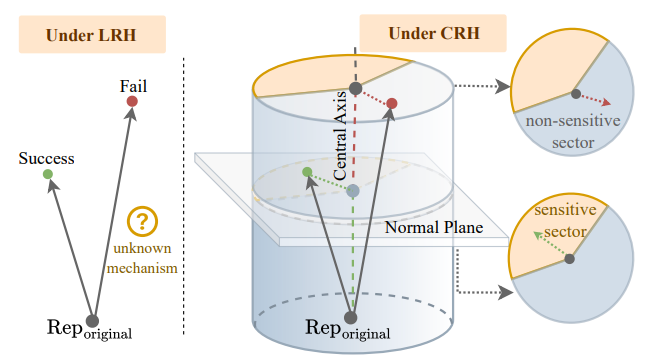

# The Cylindrical Representation Hypothesis for Language Model Steering

<p align="center">
  <a href="https://icml.cc">
    
  </a>
  <a href="https://huggingface.co/datasets/LangGao/CRH_Data">
    
  </a>
  <a href="https://arxiv.org/pdf/2605.01844">
    
  </a>
  <a href="LICENSE">
    
  </a>
</p>

> **Note**: We additionally provide a full dataset at [Hugging Face Hub](https://huggingface.co/datasets/LangGao/CRH_Data), which includes not only the data but also **pre-extracted activations and difference vectors** from both Gemma and LLaMA models that can be directly used for analysis.

## Overview

The **Cylindrical Representation Hypothesis (CRH)** extends the Linear Representation Hypothesis (LRH) by allowing overlapping concept contributions. CRH models the internal representation space as a cylinder geometry, explaining irregular steering outcomes through:

- **Central Axis**: Core direction representing the main concept
- **Normal Plane**: Perpendicular plane capturing orthogonal variations
- **Sensitive Sectors**: Regions in the cylinder where steering is more effective
- **Non-sensitive Sectors**: Regions where steering has limited effect

<p align="center">
  
  <br>
  <em><strong>Figure 1</strong>: Comparison between LRH and CRH. Under LRH (left), steering outcomes follow simple linear patterns. Under CRH (right), the cylindrical geometry with sensitive/non-sensitive sectors explains irregular steering behavior.</em>
</p>

## Project Structure

| Directory | Paper Section | Description |
|-----------|---------------|-------------|
| `baseline_exp/` | §5 | Baseline steering experiments (mean center, PCA, probe) |
| `penalty_exp/` | §6.2 | Penalty-based steering controls |
| `location_exp/` | §6.3 | Prompt steering location experiments |
| `causal_intervention/` | §7 | Causal intervention tests |
| `visualization/` | §6 | Visualization scripts for CRH implications |
| `output_labelling/` | - | Utilities for labeling model outputs |
| `CRH_Data/` | - | Dataset artifacts |
| `llm-steering-opt/` | - | Steering optimization library |

| File | Description |
|------|-------------|
| `extract_vecs_with_actis.py` | Vector extraction pipeline |
| `env.yaml` | Conda environment specification |
| `steering_results.tar.gz` | Steering results in JSON format |

---

## Getting Started

### 1. Set up Environment

```bash
# Create conda environment from env.yaml
conda env create -f env.yaml
conda activate crh
```

### 2. Prepare Data

Download the full dataset from [Hugging Face Hub](https://huggingface.co/datasets/LangGao/CRH_Data). The dataset includes:
- Prompt-response pairs
- Pre-extracted activations from Gemma-2B and LLaMA-2-7B
- Pre-computed difference vectors ready for analysis

Place the downloaded data in the `CRH_Data/` directory.

### 3. Extract Difference Vectors (Optional)

If you want to extract vectors from scratch instead of using pre-extracted ones:

```bash
# For Gemma-2B
python extract_vecs_with_actis.py \
    --csv_path CRH_Data/data_pairs_gemma2b_805_filtered.csv \
    --model_name /path/to/gemma-2b-it \
    --output_dir CRH_Data/diff_vecs_with_actis/gemma2b

# For LLaMA-2-7B
python extract_vecs_with_actis.py \
    --csv_path CRH_Data/data_pairs_llama7b_805_filtered.csv \
    --model_name /path/to/Llama-2-7b-chat-hf \
    --output_dir CRH_Data/diff_vecs_with_actis/llama2-7b-chat
```

**Arguments:**
- `--csv_path`: CSV file with concept-response pairs
- `--model_name`: Hugging Face model name or local path
- `--output_dir`: Output directory for extracted vectors
- `--layer_idx`: (Optional) Single layer index (0-based)
- `--device`: (Optional) Device (cuda/cpu), auto-select by default
- `--overwrite`: (Optional) Recompute even if output exists

### 4. Quick Start: Run an Experiment

Choose an experiment corresponding to the paper section you want to reproduce:

| Paper Section | Directory | How to Run |
|---------------|-----------|------------|
| §5 | `baseline_exp/` | `cd baseline_exp && bash run_baseline.sh` |
| §6.2 | `penalty_exp/` | Run scripts in `penalty_exp/` |
| §6.3 | `location_exp/` | `cd location_exp && bash run_location.sh` |
| §7 | `causal_intervention/` | See detailed usage below |

---

## Experiments by Paper Section

### §5 - Baseline Steering Experiments
Directory: `baseline_exp/`

```bash
cd baseline_exp
bash run_baseline.sh
```

Scripts included:
- `mean_center_steer_experiments_batch_*.py` - Mean center steering
- `pca_steer_experiments_batch_*.py` - PCA-based steering
- `probe_steer_experiments_batch_*.py` - Probe-based steering

### §6.2 - Penalty-based Steering Controls
Directory: `penalty_exp/`

```bash
cd penalty_exp
python full_exp_steer_experiments_batch_gemma.py
python full_exp_steer_experiments_batch_llama.py
```

### §6.3 - Steering Location Experiments
Directory: `location_exp/`

```bash
cd location_exp
bash run_location.sh
```

Scripts included:
- `all_prompt_steer_experiments_batch_*.py`
- `last_prompt_steer_experiments_batch_*.py`
- `output_prompt_steer_experiments_batch_llama.py`
- `output_token_steer_experiments_batch_gemma.py`

### §7 - Causal Intervention Tests
Directory: `causal_intervention/`

#### Step 1: Train Spiral Probe

```bash
python causal_intervention/train_probe.py \
    --vectors_path CRH_Data/diff_vecs_with_actis/gemma2b/9/vectors.pt \
    --output_dir ./probes/gemma2b_layer9 \
    --visualize
```

**Arguments:**
- `--vectors_path`: Path to vectors tensor .pt file
- `--output_dir`: Output directory for probe artifacts
- `--k`: PCA dimension (default: 5)
- `--visualize`: Save visualization plots

**Output files:**
- `probe.pt`: Trained probe dictionary
- `probe_meta.json`: Metadata JSON
- `spiral_probe_visualization.png`: Visualization

#### Step 2: Optimize Steering Vectors

```bash
python causal_intervention/optim_vecs.py \
    --model_name /path/to/gemma-2b-it \
    --prompt_ori "Describe the structure of an atom. Output in json." \
    --prompt_tgt "Describe the structure of an atom. Output in python." \
    --src_response '```json' \
    --dst_response '```python' \
    --layer_idx 9 \
    --save_path ./opt_results
```

#### Step 3: Run Intervention

```bash
python causal_intervention/intervention.py \
    --model_name /path/to/gemma-2b-it \
    --probe_path ./probes/probe.pt \
    --vectors_path ./vectors.pt \
    --prompt "User question here" \
    --src_response "Source response" \
    --dst_response "Target response" \
    --prompt_ori "Original prompt" \
    --prompt_tgt "Target prompt" \
    --layer 9 \
    --output_csv ./intervention_results.csv
```

---

## Visualization (§6)

After running experiments and labeling outputs, use these scripts to generate figures.

### Output Labeling (Required before visualization)

```bash
python output_labelling/output_labelling.py \
    --input_path ./steering_results/raw_results.json \
    --output_path ./steering_results/labeled_results.json
```

### §6.2, Implication 2 - Trigonometric Relationship

Analyzes the relationship between steerability and:
$$s(\theta) \propto \sin^m(\theta) \cdot \cos^n(\theta)$$
where $\theta$ is the angle between the steering vector and the central axis.

```bash
python visualization/sincos_rel.py \
    --labeled_results_path ./steering_results/labeled_results.json \
    --output_dir ./figures \
    --diffmean_power 2 \
    --sin_cos_power_p 2.0 \
    --sin_cos_power_t -1.0
```

**Arguments:**
- `--labeled_results_path`: Path to labeled results JSON file
- `--output_dir`: Output directory for results
- `--diffmean_power`: Power for normalization: `y = steerability / |diffmean|^a`

**Output:** PDF figure with Pearson correlation and p-value curves

### §6.2, Implication 3 - Diff-vector Similarity Analysis

```bash
python visualization/cannot_determine.py \
    --labeled_results_path ./steering_results/labeled_results.json \
    --diffvec_base_path ./diff_vecs_with_actis \
    --output_dir ./figures
```

**Output:** Scatter plot with window-averaged trend line and Spearman correlation

### §6.2 - Distribution Analysis

```bash
python visualization/draw_distri_fullratio.py \
    --results_path ./steering_results/penalty_results/ \
    --output_dir ./figures
```

**Output:** Heatmaps of corrupted outputs and outputs with target concept

---

## Citation

If you find CRH useful for your research and applications, please cite:

```bibtex
@inproceedings{gao2024cylindrical,
  title={The Cylindrical Representation Hypothesis for Language Model Steering},
  author={Gao, Lang and Zhang, Jinghui and Liu, Wei and Ji, Fengxian and Wang, Chenxi and Song, Zirui and Ghosh, Akash and Mohamed, Youssef and Nakov, Preslav and Chen, Xiuying},
  booktitle={International Conference on Machine Learning},
  year={2026},
  note={To appear},
  eprint={2605.01844},
  archivePrefix={arXiv},
  primaryClass={cs.CL}
}
```

## Acknowledgments

We thank [llm-steering-opt](https://github.com/jacobdunefsky/llm-steering-opt) for providing the steering vector optimization framework that our code builds upon.

## License

This project is licensed under the MIT License - see the [LICENSE](LICENSE) file for details.
